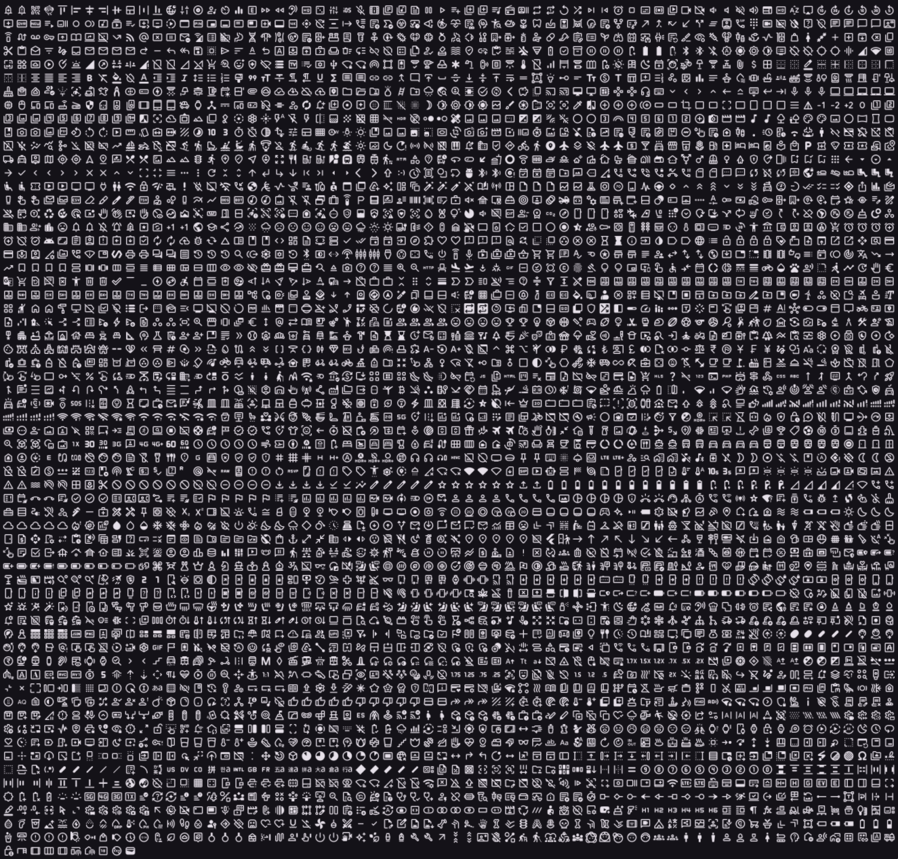
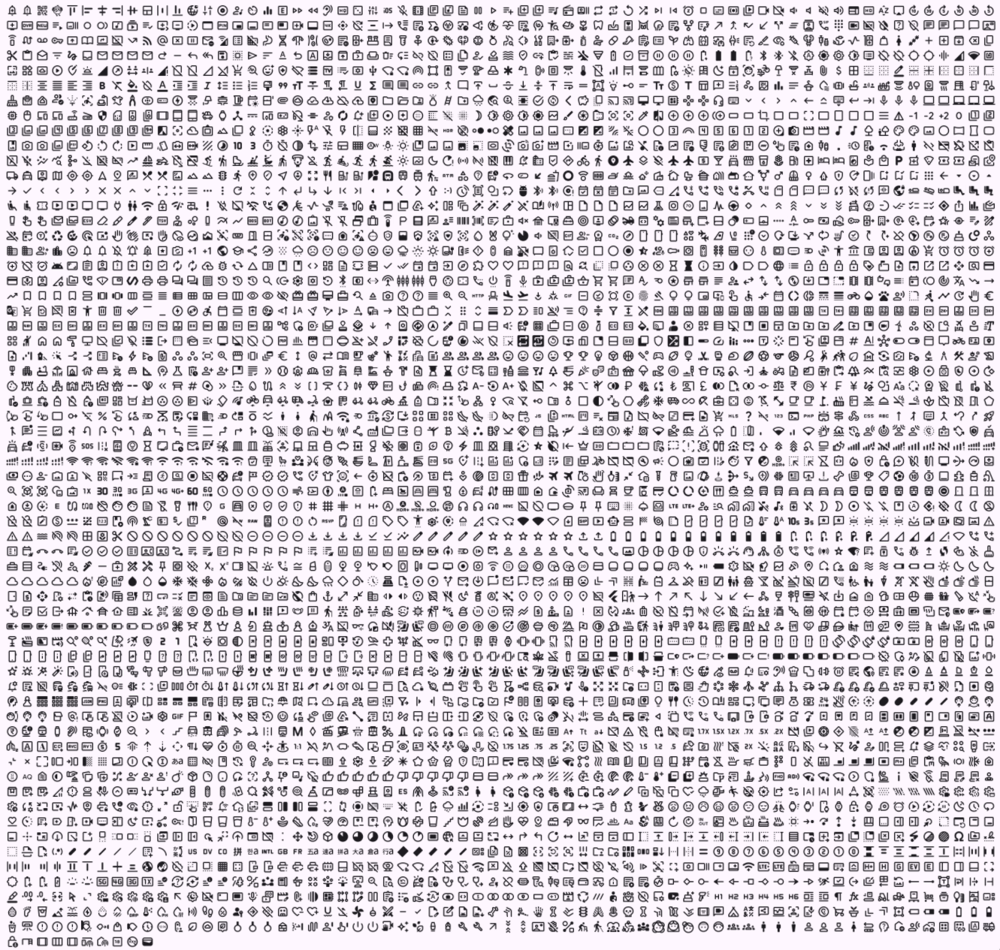
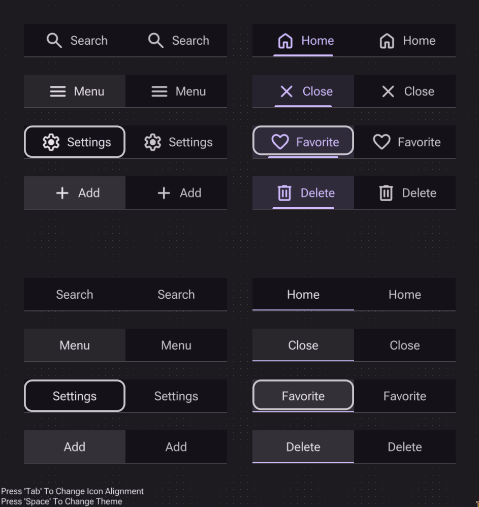
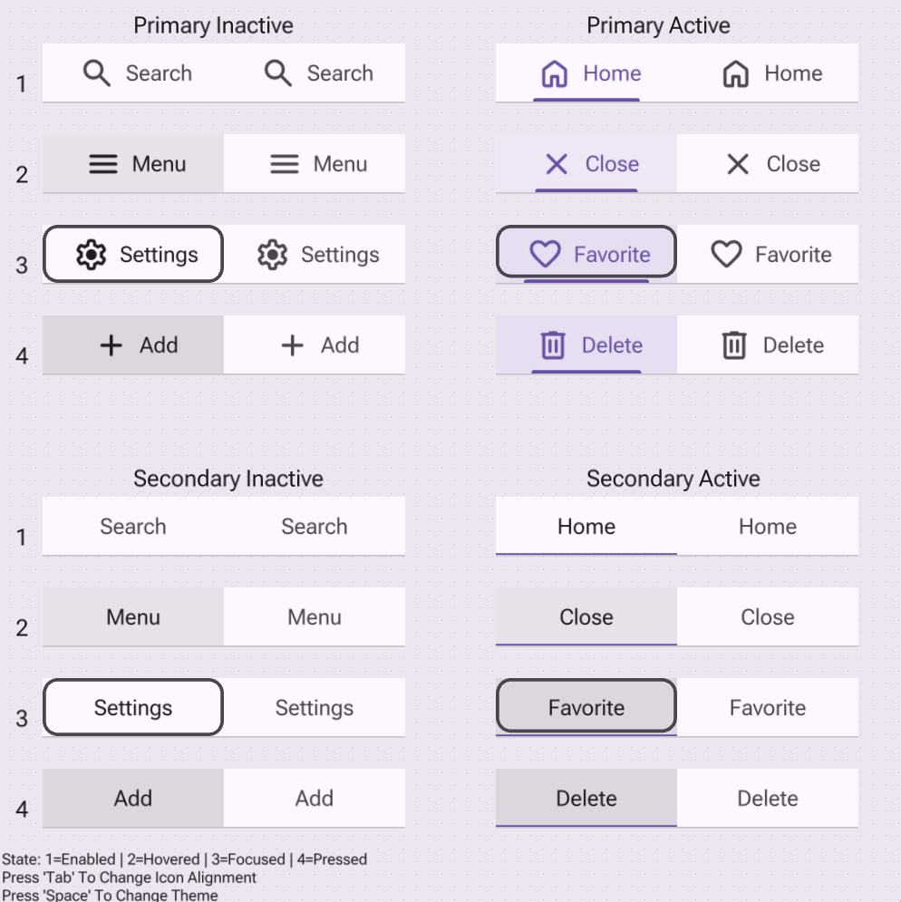
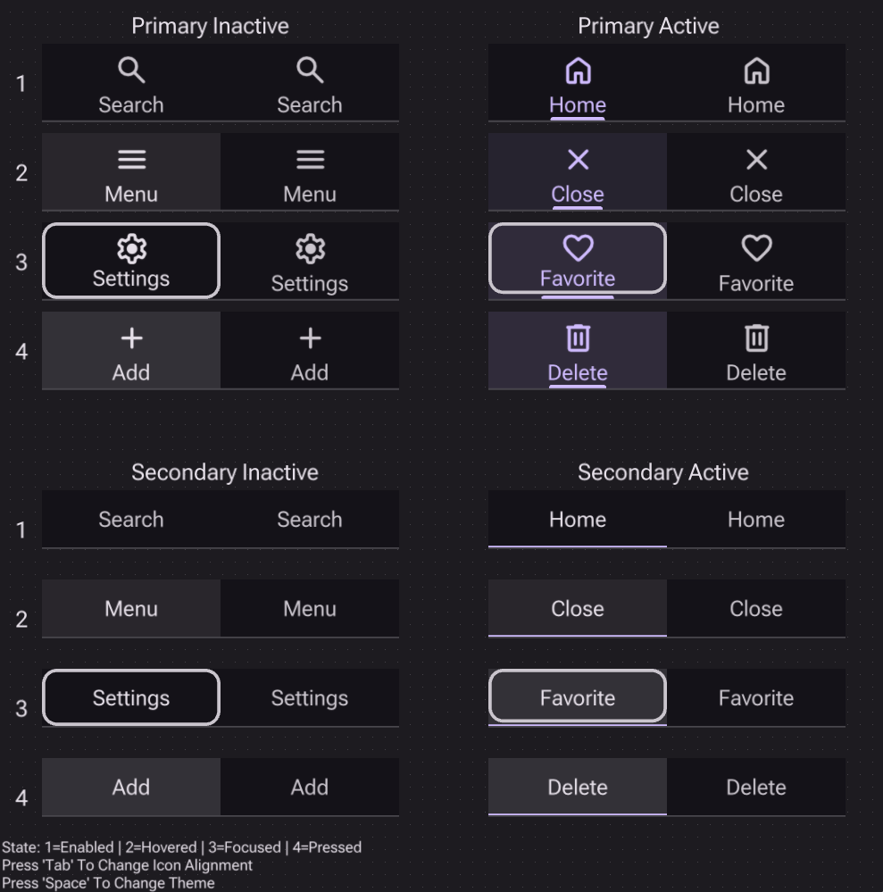
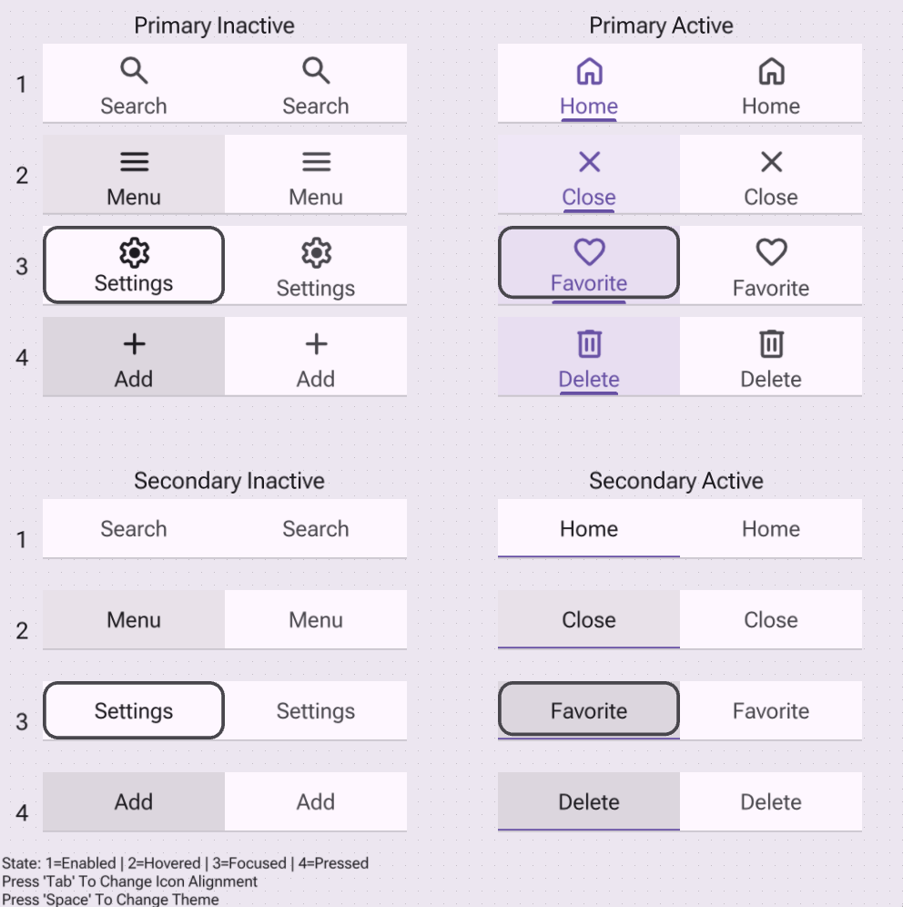
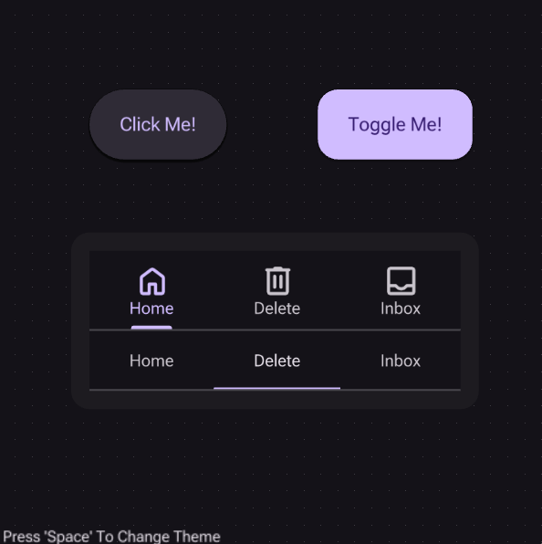
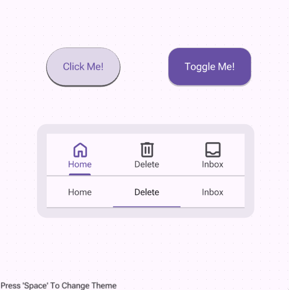
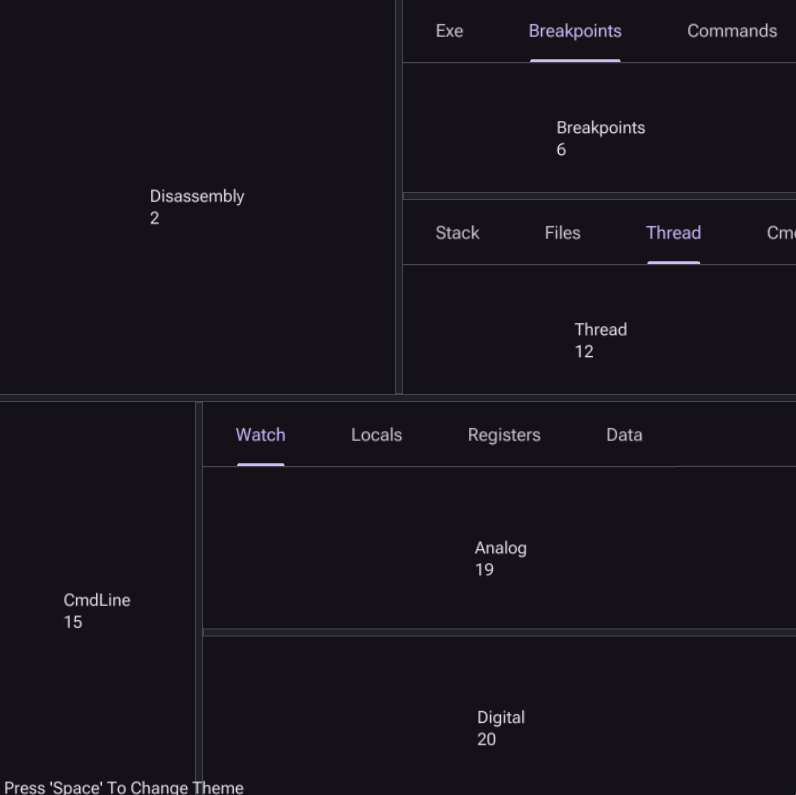
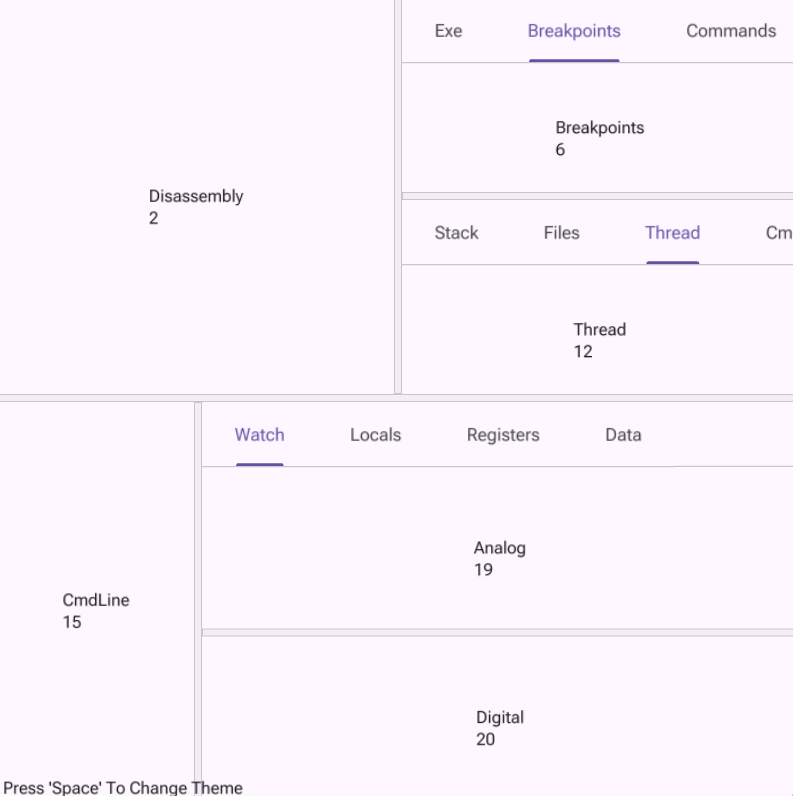

# Material Design in C

## Building

1. Unpack the archives in `thirdparty/` and `assets/`
2. Bootstrap the builder: `cc -o nob nob.c`
3. Run the builder: `./nob`

---

## Demo 1 - Scheme Colors

| Dark Scheme | Light Scheme |
|-------------|--------------|
|  |  |

---

## Demo 2 - All Colors

| All Colors (Interpolated) | Provided Colors |
|---------------------------|-----------------|
|  |  |

---

## Demo 3 - Rounded Rectangles

---

## Demo 4 - Button Reference

| Dark Scheme | Light Scheme |
|-------------|--------------|
|  |  |

---

## Demo 5 - Material Symbols

| Dark Scheme | Light Scheme |
|-------------|--------------|
|  |  |

---

## Demo 6 - Tabs

| Dark Scheme | Light Scheme |
|-------------|--------------|
|  |  |
|  |  |

---

## Demo 7 - Interactive (Manual)

| Dark Scheme | Light Scheme |
|-------------|--------------|
|  |  |

---

## Demo 8 - Layoting Engine (Interactive)

> [!Note]
> This is an actually interactive demo,  
> the tabs can be selected and the dividers can be moved.  
> The layout is described in the `MakeLayout` function in the `demo-8.c` file.

| Dark Scheme | Light Scheme |
|-------------|--------------|
|  |  |
