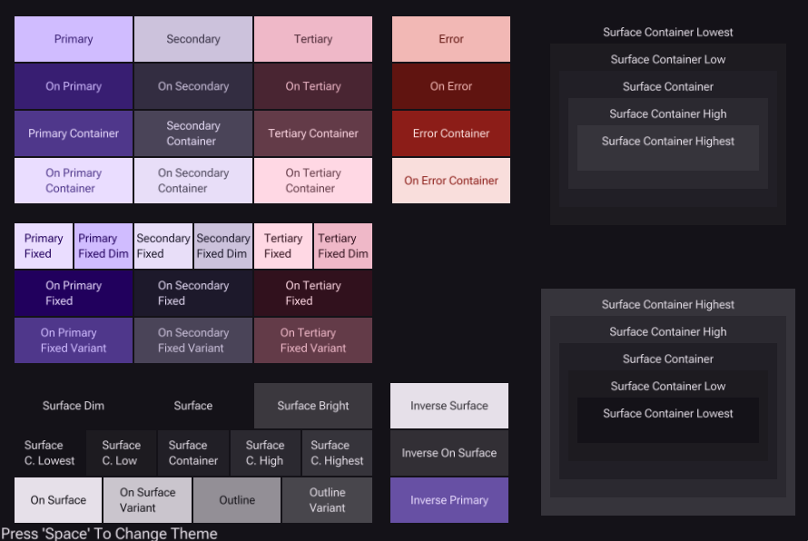
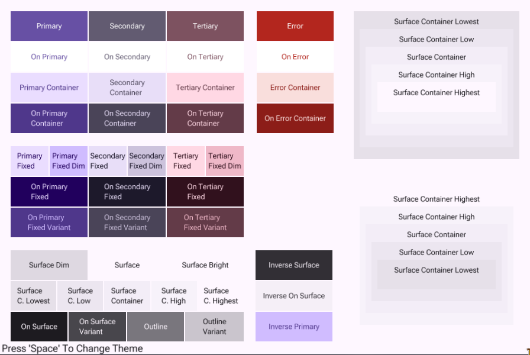
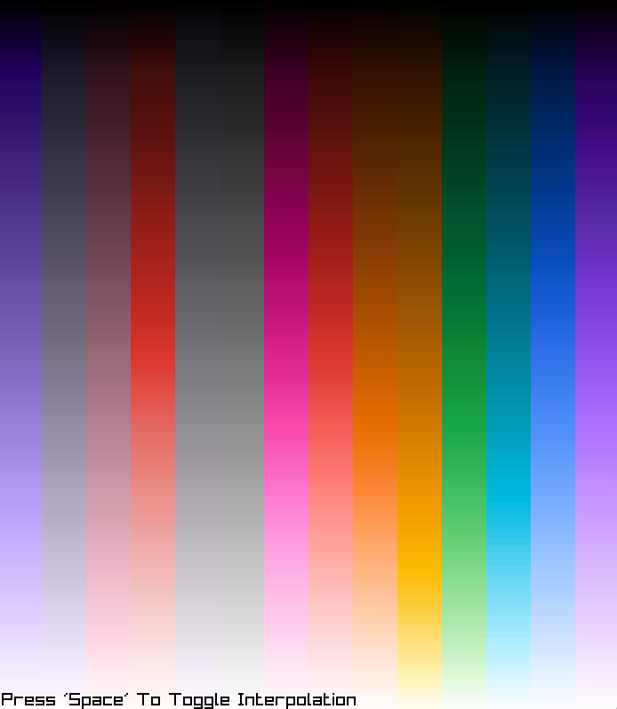
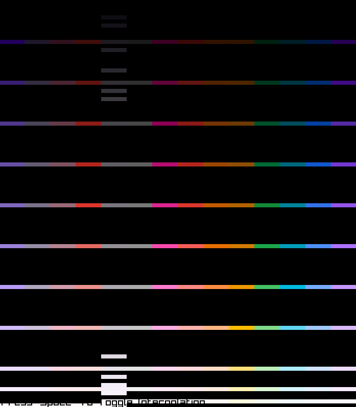
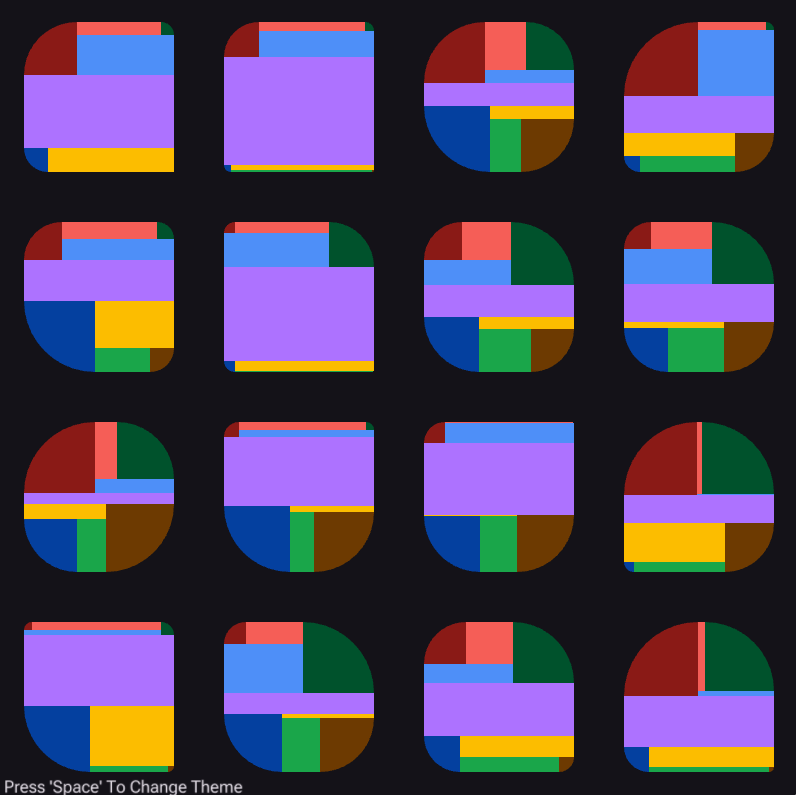
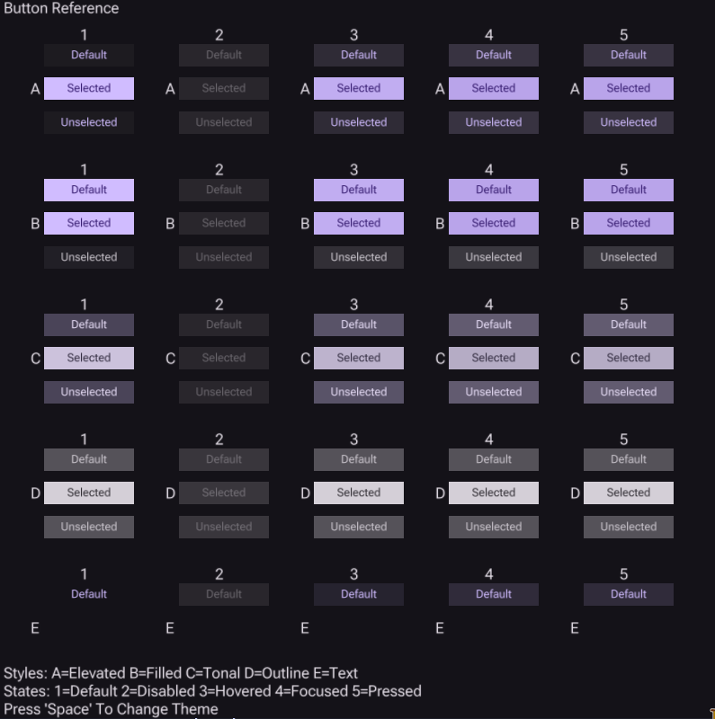
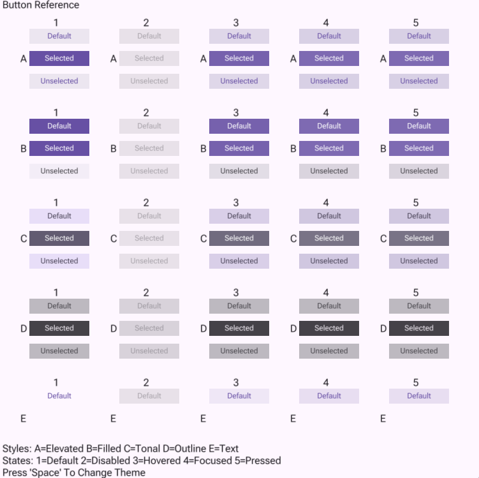

# Material Design in C

## Building

```sh
cc -o nob nob.c
./nob
```

## Demo 1 - Scheme Colors

| Dark Scheme | Light Scheme |
|-------------|--------------|
|  |  |

---

## Demo 2 - All Colors

| All Colors (Interpolated) | Provided Colors |
|---------------------------|-----------------|
|  |  |

---

## Demo 3 - Rounded Rectangles



---

## Demo 4 - Button Reference

> [!NOTE]
> This is a WIP (work in progress)
> Currently there are only the used colors + state layers (SL is possibly done incorrectly).
> The Hovered state and Elevated and Outline styles should have effects such as shadows and outlines.

| Dark Scheme | Light Scheme |
|-------------|--------------|
|  |  |
